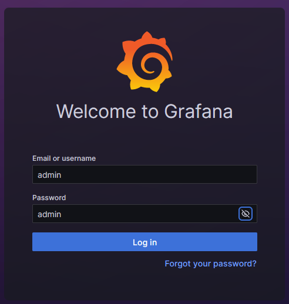
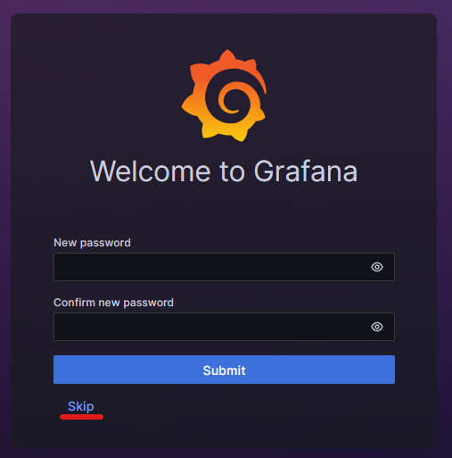
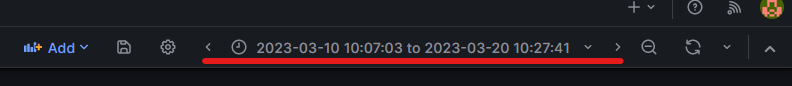
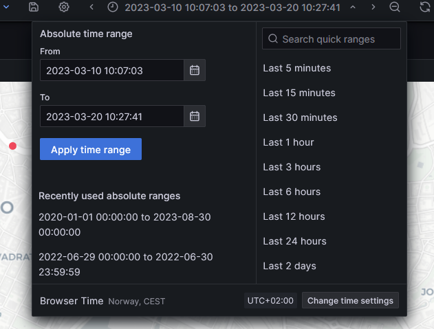
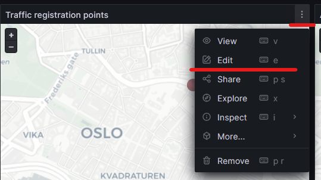
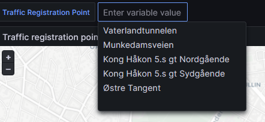
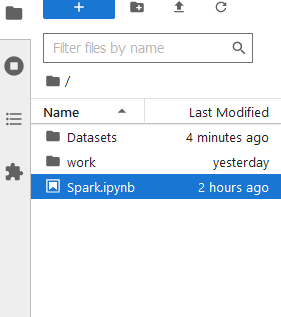
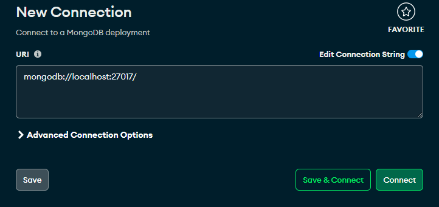

# CS4010 Project

In this project we have been working on gathering, transforming, storing and visualizing traffic data from the Norwegian Public Roads Administration, with the goal of seeing how speed, traffic volume and weather conditions affect each other and accidents. 

# Table of Contents

- [Setup Guide](#setup-guide)
  - [Prerequisites](#prerequisites)
  - [Setup](#setup)
- [Usage](#usage)
  - [Grafana](#grafana)
  - [Jupyter Notebook](#jupyter-notebook)
  - [MongoDB](#mongodb)
- [Tools and Technologies](#tools-and-technologies)
- [Traffic Registration Points](#traffic-registration-points)

# Setup Guide

## Prerequisites

You need to have this installed.

- Git
- Docker
- Docker Compose
- Python
  - Dependencies are listed [here](dev/preprocessing-scripts/dependencies.md)
- Docker desktop (Optional, if you want a GUI)
- MongoDB Compass (Optional, if you want to GUI to connect to DB)

## Setup

Clone this repository. Do this with:

- `git clone git@github.com:hevos93/CS4010.git`

> **Warning!**
> If you are using linux, prepend the docker commands with "sudo", unless you will encounter permission issues.

Navigate to the cloned git folder using a shell on Linux or by using Powershell on Windows. When you are in the project folder, navigate to the directory "prod" and enter the following command (If you want to start the containers at a later point again, use the same command):

- `docker compose up -d --build`

After the images has been downloaded and started, it is possible to check the status of the containers using:

- `docker compose ps -a`

Or by entering docker desktop and looking at the running containers using the GUI.

When you want to shut down the running containers, navigate to the same directory as before and enter the following command:

- `docker compose down`

If something problematic happens, and it may be beneficial to restart containers with this command:

- `docker compose restart`

### Notes about the containers

There are several containers that should be up and running.
| Container Name | Container Image | Notes | Access URI |
| --- | --- | --- | --- |
| mongodb | Mongo:7.0.0 | Official MongoDB image | mongodb://localhost:27017, this is accessible through MongoDB Compass |
| mongo-seed | Custom | Based on Mongo:7.0.0 which has data inserted into, this imports the correct data into mongodb and then turns off | None |
| grafana | Custom | Based on Grafana/Grafana-OSS:10.0.0. This image has a prepoulated database which is configured correctly | http://localhost:3000, web browser |
| jupyter | Custom | Based on Jupyter/Pyspark-notebook:latest, and has the notebook included | http://localhost:8888/lab, web browser |
| spark | bitnami/spark:3.4 | Spark master | http://localhost:8080 |
| spark-worker | bitnami/spark:3.4 | Spark master, this container can be scaled into multiple containers | None |

# Usage

After you have confirmed that the containers are running, you can start to use the containers.

## Grafana

### Logging in

Go to http://localhost:3000 in your web browser. You are then greeted by a sign-in page.

- Username is "admin"
- Password is "admin"

After logging in you are prompted to change the password, you can do so if you like, but remember it. If you change it will be reverted to "admin" when the container restarts.

After completing the log in you should be greeted with the correct dashboard.

### Using the dashboard

There are several graphs and maps in this dashboard, you can look at each of them by scrolling up and down. With the maps you can drag the map around and zoom in and out if you find something interesting. There are several dots around, by hovering and pressing theses you will find additional information.

When looking at graphs you should notice your cursor gets tracked, if you press at one point in the graph and drag the cursor, either forward or backward, in time and release. The time should be adjusted to that time interval.

To adjust the global time interval without using graphs, you can look in the top right corner, and find the time widget.

When you left click on the widget, the time editor pops out. With this you can use on of the preset times at the right side, or choose a custom time by using the timestamps.

> **Info!**
> The total timerange in this project are 2020-01-01 00:00:00 to 2023-08-30 11:00:00

To look at the queries used towards MongoDB you need to press the options in the graph. This button is found by hovering over the title pane of the graph and is located in the top right corner. Furthermore, pressing the edit button in the drop-down menu brings you to the query editor.

There is one global variable to the Traffic dashboard which can be changed. This is which Traffic Registration Point the dashboard focus on. This can be changed in the upper left corner.

## Jupyter Notebook

To access the notebook, navigate to http://localhost:8888/lab in you web browser.
In the list to the left you will see Spark.ipynb, this is the python file used to connect to the database, transform data and insert the datasets. There is also a folder called "Datasets" which contains CSV files.

## MongoDB

To access MongoDB you need to use a NoSQL viewer, such as "MongoDB Compass" or "NoSQL Booster for MongoDB" and connect to mongodb://localhost:27017.

# Tools and Technologies

- Python
- MongoDB
- Spark
- Grafana

# Traffic Registration Points

| Name                         | Road Reference   | TRPID         |
| ---------------------------- | ---------------- | ------------- |
| VATERLANDTUNNELEN            | RV162 S1D1 m2975 | 29403V625517  |
| Kong Håkon 5.s gt Nordgående | RV162 S1D1 m827  | 71241V2460301 |
| MUNKEDAMSVEIEN               | RV162 S1D1 m4949 | 64557V625518  |
| Kong Håkon 5.s gt Sydgående  | RV162 S1D1 m1064 | 29852V2460300 |
| Østre Tangent                | RV162 S1D1 m2015 | 73840V2041694 |
